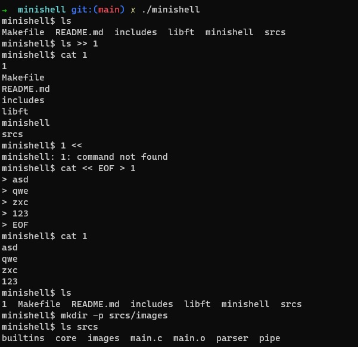
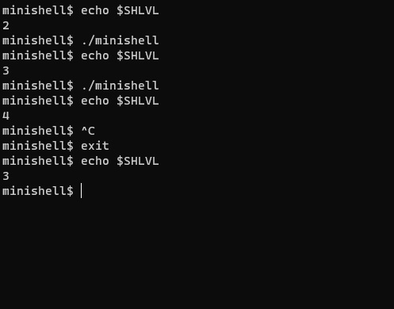
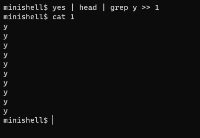
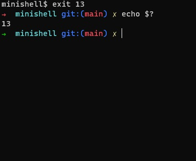

  What is it?
  -----------
  
  This is the program that mimic real shell. That is like little own bash or zsh.
  
  Contributors
  -----------
  
  outoftalentxD, nemal300
   
  Little shell should:
  -----------
  
  * Not interpret unclosed quotes or unspecified special characters like \ or ;.
  * Not use more than one global variable.
  * Show a prompt when waiting for a new command.
  * Have a working History.
  * Search and launch the right executable (based on the PATH variable or by using
  relative or absolute path)
  * It must implement the builtins:
      + echo with option -n
      + cd with only a relative or absolute path
      + pwd with no options
      + export with no options
      + unset with no options
      + env with no options or arguments
      + exit with no options
  * ’ inhibit all interpretation of a sequence of characters.
  * " inhibit all interpretation of a sequence of characters except for $.
  * Redirections:
      + "<" should redirect input.
      + ">" should redirect output.
      + “<<” read input from the current source until a line containing only the delimiter is seen. it doesn’t need to update history!
      + “>>” should redirect output with append mode.
  * Pipes | The output of each command in the pipeline is connected via a pipe to the
  input of the next command.
  * Environment variables ($ followed by characters) should expand to their values.
  * $? should expand to the exit status of the most recently executed foreground
  pipeline.
  * ctrl-C ctrl-D ctrl-\ should work like in bash.
  * When interactive:
      + ctrl-C print a new prompt on a newline.
      + ctrl-D exit the shell.
      + ctrl-\ do nothing
  
  
  Usage
  -----------
  ```
  make
  ./minishell
  ```
  
  minishell has started ans showing you a prompt. Now use this just lika a real bash.
  
  Examples
  -----------
  
  
  
  

  
  
  
  
  
  
  


